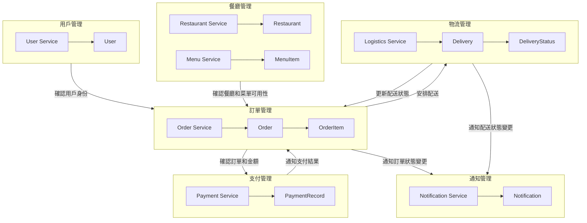

# GoDine

[](https://github.com/blackhorseya/godine/actions?query=workflow:"Go")
[](https://sonarcloud.io/summary/new_code?id=blackhorseya_godine)
[](https://sonarcloud.io/summary/new_code?id=blackhorseya_godine)
[](https://github.com/blackhorseya/godine/releases/)


GoDine is an online food ordering system designed using Golang and following the principles of Domain-Driven Design (
DDD). The system includes multiple business domains such as User Management, Restaurant Management, Order Management,
Payment Management, and Notification Management. Each domain has clear boundaries and interacts with other domains to
provide a seamless online dining experience.

## Project Name Explanation

The name GoDine is derived from combining "Golang" and "Dine", representing an online food ordering system built using
Golang. This name is concise and representative, conveying the core functionality of the project, which is to provide
efficient online dining services using Golang technology.

## Features

- **User Management**: User registration, login, profile updates, account deletion.
- **Restaurant Management**: Restaurant information management, menu management.
- **Order Management**: Order creation, order status updates, order queries.
- **Payment Management**: Handling order payments, payment record queries.
- **Notification Management**: Sending notifications to users (e.g., order status updates).

## Technical Details

- **Programming Language**: Golang
- **Architecture Pattern**: Domain-Driven Design (DDD)
- **Major Modules**:
    - **User Management**: Responsible for user registration, login, profile management, etc.
    - **Restaurant Management**: Responsible for restaurant information and menu management.
    - **Order Management**: Handles order creation, management, and tracking.
    - **Payment Management**: Processes payments and manages payment records.
    - **Notification Management**: Sends notifications regarding order status changes to users.

## System Architecture Diagram



## Installation

1. **Clone the repository**:
    ```bash
    git clone https://github.com/blackhorseya/godine.git
    ```
2. **Navigate to the project directory**:
    ```bash
    cd godine
    ```
3. **Install dependencies**:
    ```bash
    go mod tidy
    ```

## Usage

1. **Run the service**:
    ```bash
    go run .
    ```
2. **Access the service**:
    - API documentation is available at `http://localhost:8080/swagger/index.html`.

## Contribution

We welcome contributions to this project. Please follow these steps:

1. **Fork the repository**
2. **Create your feature branch**:
    ```bash
    git checkout -b feature-branch
    ```
3. **Commit your changes**:
    ```bash
    git commit -am 'Add some feature'
    ```
4. **Push to the branch**:
    ```bash
    git push origin feature-branch
    ```
5. **Create a Pull Request**

## License

This project is licensed under the GPL-3.0 License. See the [LICENSE](LICENSE) file for details.

```

This README file provides a comprehensive overview of the GoDine project, including its name explanation, features, technical details, system architecture diagram, installation instructions, usage guidelines, contribution steps, and licensing information.